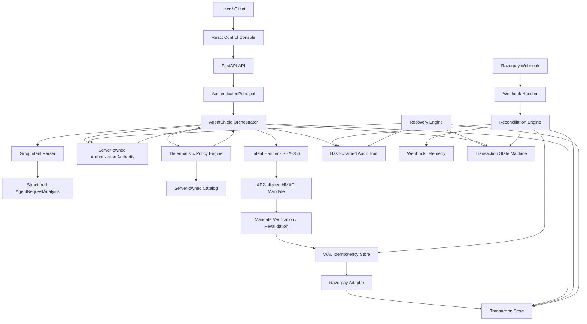
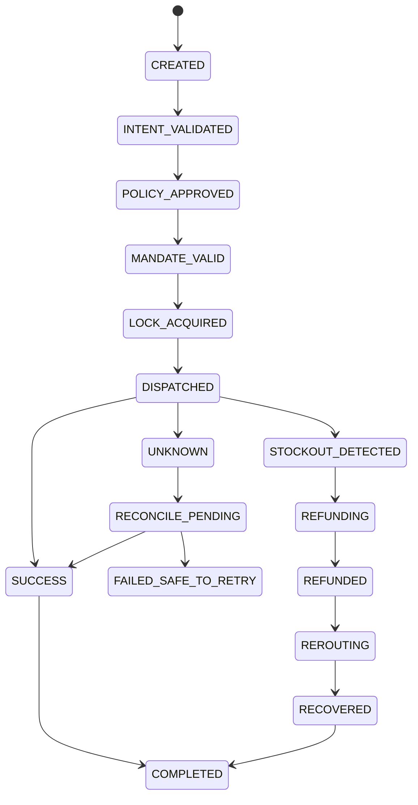
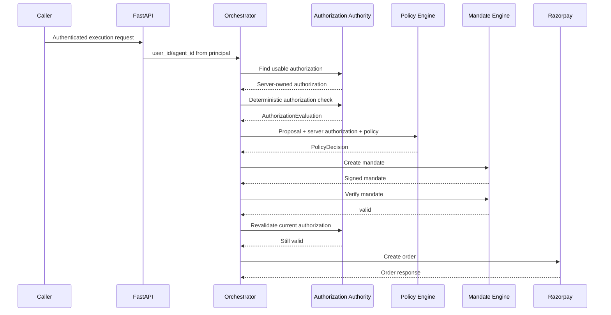
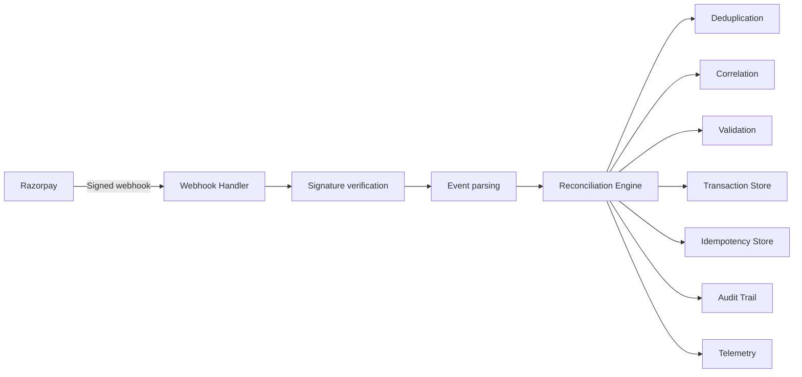
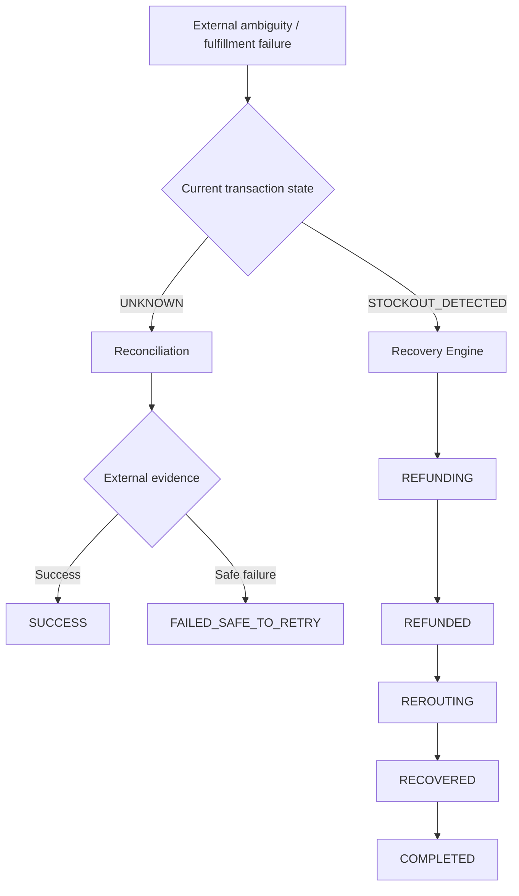

# AgentShield 

> **Deterministic governance and control plane for AI-initiated financial actions**

AgentShield is a security-first transaction orchestration system that places a deterministic control plane between an AI agent and a payment rail. An LLM may interpret a natural-language request and propose a structured transaction, but it does **not** own identity, spending authority, policy decisions, payment state, or execution rights.

The core rule is simple:

> **The model proposes. AgentShield decides.**

The current reference implementation uses **Groq for intent interpretation**, **Razorpay in test mode as the payment adapter**, **SQLite/WAL for persistence and concurrency controls**, **FastAPI for the API boundary**, and **React + TypeScript + Vite for the demo control console**.

AgentShield is designed as an **AP2-aligned reference implementation** for agent-initiated payment governance. It should not be interpreted as formal certification or compliance with any external specification.

---

## Why AgentShield exists

Most AI-agent payment demos focus on whether a model can understand a request and call a payment API. That is not sufficient for a system that can move money.

The security boundary must be explicit:

- The LLM can be wrong or manipulated.
- User identity must come from the authenticated server context, not from model output.
- Authorization must come from server-owned records.
- Policy must be evaluated deterministically.
- The exact governed transaction must be cryptographically bound to the authorization.
- Duplicate requests must not create duplicate execution.
- An uncertain external result must be represented as **UNKNOWN**, not silently retried.
- Webhook events must be authenticated, correlated, deduplicated, and reconciled.
- Recovery actions must obey the same governance model as the original execution.
- Audit evidence must be tamper-evident and independently verifiable.

AgentShield turns those principles into explicit application code, state transitions, persistence models, and tests.

---

# Architecture

## System-level architecture



## Execution sequence

A normal execution follows this order:

```text
1. Authenticate caller
2. Derive server-owned user_id / agent_id
3. Parse natural-language request with Groq
4. Validate the LLM output
5. Reject any identity drift in the model output
6. Create/load the server-owned transaction record
7. Move CREATED → INTENT_VALIDATED
8. Resolve the server-owned authorization
9. Verify authorization deterministically
10. Snapshot the exact authorization onto the transaction
11. Evaluate deterministic policy + catalog facts
12. Move → POLICY_APPROVED
13. Canonicalize + hash governed intent
14. Create HMAC-signed mandate
15. Verify the mandate
16. Move → MANDATE_VALID
17. Revalidate the authorization before external execution
18. Acquire idempotency key atomically
19. Move → LOCK_ACQUIRED
20. Create the Razorpay order
21. Verify returned amount/currency/status
22. Persist Razorpay order ID
23. Move → DISPATCHED
24. Wait for an authenticated webhook
25. Reconcile the external event
26. Update transaction + idempotency + audit state
27. Recover only through explicit recovery transitions
```

The orchestrator is intentionally responsible for **ordering** these gates. Individual engine classes own the deterministic rules inside each gate.

---

# Trust model

AgentShield uses a strict trust hierarchy.

```text
                         TRUST BOUNDARY
┌───────────────────────────────────────────────────────────────┐
│ Untrusted / advisory                                         │
│                                                               │
│   User text → LLM interpretation → structured proposal       │
│                                                               │
└───────────────────────────────┬───────────────────────────────┘
                                │
                                ▼
┌───────────────────────────────────────────────────────────────┐
│ Server-owned control plane                                   │
│                                                               │
│   Identity → Authorization → Policy → Catalog → Hash         │
│   → Mandate → Idempotency → Payment → Reconciliation         │
│                                                               │
└───────────────────────────────────────────────────────────────┘
```

### What the LLM can do

The model can:

- interpret natural-language intent;
- identify merchant/SKU/amount/currency information from the request;
- produce a structured analysis for deterministic validation.

### What the LLM cannot decide

The model cannot independently:

- authenticate the caller;
- choose which user or agent owns the transaction;
- grant itself additional spending authority;
- override a revoked/inactive authorization;
- raise a policy limit;
- override catalog price or merchant facts;
- bypass idempotency;
- declare a payment successful;
- choose an unsafe recovery path.

The orchestrator explicitly verifies that the structured model output remains bound to the server-provided `user_id`, `agent_id`, and `intent_id`.

**AgentShield does not sandbox the LLM or Razorpay process; it isolates financial authority at the application control-plane boundary.**

---

# Core security invariants

These are the properties the implementation is designed to preserve.

### 1. Server-owned identity

The execution endpoint derives identity from the authenticated principal rather than accepting `user_id` and `agent_id` in the execution payload.

```text
HTTP Authorization header
        ↓
AuthenticatedPrincipal
        ↓
user_id / agent_id
        ↓
Orchestrator
```

### 2. LLM identity binding

The LLM receives server-owned identity context and the orchestrator rejects analysis results that attempt to change it.

### 3. Authorization is server-owned

`SQLiteAuthorizationAuthority` owns creation, lookup, selection, revocation, deactivation, and lifecycle state.

A missing authorization is represented as `None`; the system does not fabricate a synthetic authorization record.

### 4. Authorization evaluation is self-consistent

`AuthorizationEvaluation` binds the decision to the exact authorization object that was evaluated. An evaluation cannot claim that decision `auth_A` was produced from authorization `auth_B`.

### 5. Authorization snapshot

The exact server-owned authorization used for execution is stored on the transaction as an `authorization_snapshot`.

This gives the transaction a durable record of the authority that governed it at the point of execution.

### 6. Deterministic policy

The policy engine checks the concrete proposal against server-owned policy and catalog facts.

Examples include:

- identity match;
- INR-only boundary;
- authorization currency match;
- maximum/minimum amount;
- merchant allowlist;
- SKU allowlist;
- maximum quantity;
- catalog existence;
- catalog merchant match;
- catalog currency match;
- exact catalog-derived amount;
- bank-rail availability.

### 7. Cryptographic intent binding

The governed authorization + proposal are canonicalized and hashed using SHA-256.

Conceptually:

```text
canonical(authorization, proposal)
             ↓
        SHA-256 digest
             ↓
         intent_hash
```

A material change to the governed authorization or proposal changes the hash.

### 8. Signed, TTL-bound mandate

The mandate contains the governed identity, merchant, amount, intent hash, nonce, issuance time, and expiry. It is protected by HMAC-SHA256.

Verification checks:

- user binding;
- agent binding;
- merchant binding;
- amount binding;
- nonce binding;
- issuance time;
- expiry;
- recomputed intent hash;
- HMAC signature.

### 9. Authorization revalidation before dispatch

Authorization is not treated as permanently valid merely because an earlier check passed. The execution path can revalidate current server-owned authorization state before an external payment call.

This protects against stale authorization reuse after revocation/deactivation.

### 10. Idempotent execution

The idempotency store uses a database primary key as the concurrency authority.

There is deliberately no unsafe check-then-insert pattern:

```text
BAD:
check(key)
  ↓
if missing:
  insert(key)

GOOD:
INSERT OR IGNORE
  ↓
primary-key uniqueness
  ↓
one winner
```

### 11. UNKNOWN means unknown

If a payment call may have reached Razorpay but the client does not know the outcome, AgentShield records:

```text
DISPATCHED → UNKNOWN
```

It does **not** assume failure and blindly retry.

The intended path is:

```text
UNKNOWN
   ↓
RECONCILE_PENDING
   ↓
reconcile external evidence
```

### 12. Webhook authentication

Razorpay webhook signatures are verified over the raw request body using HMAC comparison before event parsing/reconciliation proceeds.

### 13. Webhook deduplication

Webhook event IDs are tracked separately from payment execution idempotency because:

```text
execution identity ≠ delivery identity
```

This prevents repeated webhook delivery from being treated as a new financial action.

### 14. Ownership isolation

Transaction and audit reads are scoped to the authenticated principal's `user_id` and `agent_id`.

A caller must not be able to read another principal's transaction or audit trail merely by guessing its identifier.

### 15. Hash-chained audit trail

Audit events contain:

```text
sequence
previous_event_hash
event_hash
```

The chain can be independently verified using `verify_chain()`.

### 16. Recovery is governed

Recovery actions use the transaction state machine and re-check the current authorization state where required. Recovery is not an escape hatch around governance.

---

# Transaction state machine

The transaction lifecycle is explicit and fail-aware.



The code does not permit arbitrary state jumps. `TransactionStateMachine` is the source of truth for legal transitions.

### Why `UNKNOWN` matters

The following are fundamentally different:

```text
FAILED_SAFE_TO_RETRY
```

means the system has sufficient evidence that a safe retry is possible.

```text
UNKNOWN
```

means the external outcome is uncertain.

Those states must never be conflated in a payment system.

---

# Authorization lifecycle



### Lifecycle changes

An authorization can be:

- active;
- inactive;
- revoked;
- expired.

Selection and execution are deterministic. A stale authorization snapshot does not grant authority after the current authorization has become unusable.

---

# Policy and catalog model

AgentShield deliberately separates **authorization** from **policy**.

### Authorization answers

> "Has this user granted this agent this bounded authority?"

Examples:

```text
maximum amount
allowed merchants
allowed SKUs
maximum quantity
currency
expiry
active/revoked state
```

### Policy answers

> "Does this concrete transaction satisfy the platform's deterministic operating rules?"

Examples:

```text
currency must be INR
amount must be within platform bounds
merchant must be allowed
catalog SKU must exist
catalog price must match
catalog merchant must match
payment rail must be available
```

This separation prevents one model or one object from becoming a universal authority.

---

# Cryptographic model

## Intent hash

`engine/hashing.py` canonicalizes the governed authorization and proposal before hashing.

The important property is determinism:

```text
same authorization + same proposal
            ↓
       same canonical form
            ↓
       same SHA-256 hash
```

Changing a material field changes the digest.

## Mandate signature

`engine/mandate.py` creates an HMAC-SHA256 signature over a structured payload containing:

```text
user_id
agent_id
merchant_id
amount_paise
intent_hash
nonce
issued_at
expires_at
```

The current implementation uses a shared server secret supplied through `MANDATE_SECRET_KEY`.

## Audit chain

The audit trail links each event to the previous event hash:

```text
Event 1
  event_hash = H1
       ↓
Event 2
  previous_event_hash = H1
  event_hash = H2
       ↓
Event 3
  previous_event_hash = H2
  event_hash = H3
```

Editing a historical event breaks subsequent verification.

---

# Failure handling and recovery

AgentShield assumes external systems can fail after a request has already crossed a boundary.

## External dispatch uncertainty

```text
LOCK_ACQUIRED
      ↓
Razorpay request
      ↓
network / external failure
      ↓
UNKNOWN
      ↓
reconciliation
```

The system does not blindly retry from `UNKNOWN`.

## Safe retry

The recovery engine only permits explicit safe retry transitions. Idempotency and authorization are part of the decision.

## Fulfillment recovery

For fulfillment-side problems such as stockouts, the state machine represents:

```text
STOCKOUT_DETECTED
        ↓
REFUNDING
        ↓
REFUNDED
        ↓
REROUTING
        ↓
RECOVERED
        ↓
COMPLETED
```

Each successful transition is persisted and auditable.

---

# Webhook and reconciliation flow



The webhook path is intentionally separate from the request/execute path.

A payment request and a webhook delivery have different identities and failure modes.

---

# Application layers

```text
api/
    FastAPI transport, authentication dependency, HTTP request/response models

application/
    Orchestrator and dependency container

engine/
    Deterministic business/security engines

integrations/
    LLM and Razorpay adapters

models/
    Pydantic domain contracts and state representations

webhooks/
    Razorpay webhook authentication and parsing

recovery/
    Deterministic recovery workflows

evaluation/
    Deterministic control-plane and adversarial evaluation

frontend/
    React + TypeScript control console

tests/
    Unit, integration, concurrency, security and end-to-end tests
```

---

# Repository structure

```text
agentshield-main/
├── api/
│   ├── dependencies.py        # dependency injection + authenticated principal
│   └── main.py                # FastAPI application and HTTP routes
│
├── application/
│   ├── container.py           # runtime dependency graph
│   └── orchestrator.py        # authoritative execution ordering
│
├── engine/
│   ├── authorization.py       # authorization verification + persistence
│   ├── audit.py                # hash-chained audit trail
│   ├── catalog.py              # server-owned catalog
│   ├── hashing.py              # canonicalization + SHA-256 intent hashing
│   ├── idempotency.py          # WAL-backed execution idempotency
│   ├── mandate.py              # HMAC-signed mandate creation/verification
│   ├── policy.py               # deterministic policy engine
│   ├── reconciliation.py       # webhook deduplication + reconciliation
│   ├── state_machine.py        # legal transaction transitions
│   ├── telemetry.py            # webhook telemetry persistence
│   └── transaction_store.py    # transaction persistence
│
├── evaluation/
│   ├── runner.py               # deterministic evaluator
│   ├── scenarios.py            # evaluation cases
│   ├── adversarial_runner.py   # adversarial orchestrator evaluation
│   └── adversarial_scenarios.py
│
├── integrations/
│   ├── groq.py                 # active LLM adapter
│   ├── claude.py               # Claude adapter implementation
│   └── razorpay.py             # Razorpay payment adapter
│
├── models/
│   ├── api.py                  # API request/response contracts
│   ├── authorization.py        # authorization domain contracts
│   ├── intent.py                # structured intent contracts
│   ├── mandate.py               # mandate contracts
│   ├── policy.py                # policy contracts
│   ├── telemetry.py             # webhook telemetry contracts
│   ├── transaction.py           # transaction/state contracts
│   ├── webhook.py               # webhook contracts
│   └── ...
│
├── recovery/
│   └── transaction.py          # governed recovery engine
│
├── webhooks/
│   └── razorpay.py             # raw-body signature verification + parsing
│
├── frontend/
│   └── src/                    # React control console / Flight Recorder
│
├── scripts/
│   ├── seed_demo_data.py
│   ├── run_evaluation.py
│   ├── run_adversarial.py
│   └── groq_smoke_test.py
│
├── reports/
│   ├── evaluation.json
│   └── adversarial.json
│
├── tests/                       # comprehensive automated test suite
├── .env.example
├── requirements.txt
└── server.py                    # configured application entry point
```

---

# API

## `GET /healthz`

Unauthenticated liveness endpoint.

Example:

```bash
curl http://localhost:8000/healthz
```

Response:

```json
{"status":"ok"}
```

## `POST /v1/agent/execute`

Runs the complete governed execution flow.

### Authentication

The current demo/API authentication mechanism uses a configured Bearer token. The authenticated principal is resolved server-side.

Required headers:

```http
Authorization: Bearer <AGENTSHIELD_API_TOKEN>
Idempotency-Key: <unique-logical-execution-key>
Content-Type: application/json
```

### Request body

```json
{
  "user_message": "Buy exactly one shoe_001 from merchant_001 for ₹4500.",
  "merchant_context": {
    "source": "demo"
  }
}
```

Notice that `user_id` and `agent_id` are **not** part of the request body.

### Example

```bash
curl -X POST http://localhost:8000/v1/agent/execute \
  -H "Authorization: Bearer $AGENTSHIELD_API_TOKEN" \
  -H "Idempotency-Key: demo-key-001" \
  -H "Content-Type: application/json" \
  -d '{"user_message":"Buy exactly one shoe_001 from merchant_001 for ₹4500."}'
```

The response contains the governed transaction and the generated mandate.

## `GET /v1/transactions/{transaction_id}`

Returns a transaction only when the authenticated principal owns it.

## `GET /v1/transactions/{transaction_id}/audit`

Returns the transaction's audit trail, also ownership-scoped.

The event chain contains sequence and hash-link information that can be independently verified by the audit engine.

## `POST /webhooks/razorpay`

Receives and reconciles authenticated Razorpay events.

Required headers:

```http
X-Razorpay-Signature: <signature>
X-Razorpay-Event-Id: <event-id>
```

The API verifies the raw body signature before parsing the event.

---

# Configuration

Copy the template:

```bash
cp .env.example .env
```

## Required environment variables

| Variable | Purpose |
|---|---|
| `RAZORPAY_KEY_ID` | Razorpay test-mode key ID |
| `RAZORPAY_KEY_SECRET` | Razorpay test-mode secret |
| `RAZORPAY_WEBHOOK_SECRET` | Secret used to verify incoming Razorpay webhooks |
| `MANDATE_SECRET_KEY` | Server secret for HMAC mandate signing; minimum 32 bytes |
| `AGENTSHIELD_API_TOKEN` | API Bearer credential; minimum 32 characters in the current configuration |
| `AGENTSHIELD_API_USER_ID` | Server-owned demo principal user ID |
| `AGENTSHIELD_API_AGENT_ID` | Server-owned demo principal agent ID |
| `GROQ_API_KEY` | Groq API key |
| `GROQ_MODEL` | Active Groq model identifier |

## Optional / runtime configuration

| Variable | Default | Purpose |
|---|---:|---|
| `DATABASE_PATH` | `state.db` | Prefix used for SQLite state databases |
| `MANDATE_TTL_SECONDS` | `300` | Mandate lifetime |
| `MAX_RETRIES` | `3` | Configured retry limit |
| `REQUEST_TIMEOUT_SECONDS` | `10.0` | Razorpay client timeout |
| `LLM_PROVIDER` | `groq` | Current configuration only accepts `groq` |
| `AGENTSHIELD_DEMO_MODE` | `false` | Enables the explicit permissive demo policy |

Generate strong random values with:

```bash
python -c "import secrets; print(secrets.token_hex(32))"
```

Do not commit `.env` or real credentials.

---

# Local setup

## Requirements

- Python 3.11.9 (verified runtime environment)
- Node.js 18+
- npm
- Groq account/API key for the active intent parser
- Razorpay test-mode credentials for payment-adapter integration

## 1. Clone

```bash
git clone <repository-url>
cd agentshield-main
```

## 2. Python environment

```bash
python -m venv .venv
source .venv/bin/activate
```

Windows:

```powershell
.venv\Scripts\activate
```

## 3. Install backend dependencies

```bash
pip install -r requirements.txt
```

## 4. Configure `.env`

```bash
cp .env.example .env
```

Fill in the required values described above.

## 5. Seed demo authorization and catalog

```bash
python -m scripts.seed_demo_data
```

The demo seeder creates a server-owned authorization and catalog entry used by the frontend sample flow.

## 6. Start the API (Local Demo)

For the actual demo, the explicit demo policy must be enabled — otherwise the run hits a zero-policy/configuration trap:

```bash
set -a
source .env
set +a
export AGENTSHIELD_DEMO_MODE=true
uvicorn server:app --reload --port 8000
```

## 7. Start the frontend

```bash
cd frontend
npm install
npm run dev
```

The frontend is a demonstration/control console, not a general-purpose checkout interface.

---

# Demo flow

The repository includes two intentionally simple sample requests.

### Approved example

```text
Buy exactly one shoe_001 from merchant_001 for ₹4500.
```

Expected path:

```text
Authorization    ✓
Policy           ✓
Mandate          ✓
Idempotency      ✓
Razorpay         ✓ / DISPATCHED
```

### Blocked example

```text
Buy shoe_001 from merchant_001 for ₹9000.
```

The demo authorization limits the amount, so the control plane should reject the request before payment execution.

The React console visualizes the pipeline and shows the resulting transaction/audit evidence.

---

# Flight Recorder

The frontend's centerpiece is the **Flight Recorder** — a visual lifecycle view of every governed transaction, rendered as an explicit sequence:

```text
Authorization → Policy → Mandate → Idempotency → Razorpay → Webhook → Reconciliation
```

Each stage is backed by the real transaction and audit records rather than a simulated or illustrative timeline, so what the Flight Recorder shows is exactly what the control plane did — not a stylized approximation of it.

---

# Testing

The project has an intentionally heavy test suite because payment governance must be tested as a set of invariants, not just as happy-path business logic.

The current verified suite result is:

- **352 passed** (`pytest -q`)

The test suite covers areas including:

```text
authorization
authorization authority
identity binding
policy
catalog
hashing
mandates
idempotency
concurrency
state machine
transaction store
audit chain
webhooks
reconciliation
recovery
orchestration
API boundaries
container wiring
telemetry
end-to-end flows
adversarial scenarios
```

Run the suite:

```bash
pytest -q
```

For a focused area:

```bash
pytest -q tests/test_authorization.py
pytest -q tests/test_concurrency.py
pytest -q tests/test_reconciliation.py
pytest -q tests/test_api.py
```

---

# Deterministic evaluation

`evaluation/runner.py` tests the control plane without depending on a live LLM, Razorpay, or network access.

Run:

```bash
python -m scripts.run_evaluation
```

The evaluator checks whether deterministic authorization + policy + catalog controls produce the expected allow/block result.

The checked-in report currently records:

```text
Total cases:              71
Passed:                   71
Failed:                    0
Authorization bypasses:   0
Policy bypasses:          0
Unsafe executions:        0
Duplicate executions:     0
```

These are the values stored in `reports/evaluation.json` in this repository snapshot.

---

# Adversarial evaluation

The adversarial runner simulates hostile or malformed LLM behavior without granting the test parser any real payment authority.

Run:

```bash
python -m scripts.run_adversarial
```

The repository's checked-in adversarial report currently records:

```text
Total scenarios:          20
Passed:                   20
Authorization bypasses:   0
Policy bypasses:          0
Unsafe executions:        0
Execution-after-block:    0
```

The scenarios include examples such as:

- user identity spoofing;
- agent identity spoofing;
- intent ID spoofing;
- revoked authorization;
- inactive authorization;
- amount escalation;
- quantity inflation;
- currency escalation;
- catalog amount bypass;
- merchant confusion;
- SKU confusion;
- bank-rail outage bypass;
- hallucinated approval;
- prompt-injection attempts;
- hidden quantity/currency manipulation.

This evaluation demonstrates the strength of the deterministic control plane. It is not a claim that arbitrary future LLM behavior is impossible to exploit; the system is specifically designed so the model's mistakes do not become payment authority.

---

# Observability

The code includes telemetry and persistent audit information for important lifecycle events.

Useful evidence includes:

```text
transaction_id
intent_id
user_id
agent_id
state
intent_hash
authorization_id
Razorpay order/payment IDs
audit sequence
previous event hash
event hash
webhook event ID
webhook event type
```

The frontend uses this information to render the governance pipeline for a transaction.

---

# Frontend architecture

The frontend is a React + TypeScript + Vite application under `frontend/`.

Its role is primarily **operational visibility and demonstration**.

It shows:

- request intent;
- authorization result;
- policy result;
- mandate status;
- idempotency state;
- Razorpay dispatch state;
- transaction identifiers;
- intent hash;
- authorization snapshot;
- audit events;
- blocked vs approved outcomes;
- `UNKNOWN`/reconciliation semantics where applicable.

### Frontend security note

The current demo frontend reads `VITE_AGENTSHIELD_API_TOKEN` from its build-time environment and uses it as a Bearer token. Because Vite `VITE_*` variables are client-visible, this should be treated as a **demo/development mechanism, not a production secret-storage strategy**.

A production deployment should use an actual authenticated browser session or an appropriate short-lived user access token issued by an identity provider/backend boundary.

---

# Payment integration boundary

`integrations/razorpay.py` contains the payment adapter.

The orchestrator only calls the payment integration **after** the governance gates have succeeded.

Before trusting the created order, the orchestrator verifies:

```text
returned amount == governed transaction amount
returned currency == governed currency
returned status == created
```

This prevents the external provider response from silently changing the transaction semantics.

For development and demos, use Razorpay **test mode** only.

---

# Recovery architecture

Recovery is intentionally separate from ordinary execution.



The recovery engine uses the same server-owned authorization authority and transaction state machine instead of bypassing them.

---

# Data persistence

The current implementation uses SQLite with WAL mode for the main persistent components.

The application container derives separate database files from the configured `DATABASE_PATH`, including storage for:

```text
transactions
idempotency ledger
authorizations
catalog
webhook event ledger
webhook telemetry
audit trail
```

### Why WAL?

SQLite WAL improves read/write concurrency for this single-process reference implementation and supports the project's concurrency/idempotency tests.

### Why this is not the final production datastore

The current persistence layer is appropriate for a local/demo or single-node reference deployment. A horizontally scaled production architecture would generally move critical shared state to a production database and use an explicit migration/locking strategy.

---

# Threat model

AgentShield is designed against the following classes of failure/attack:

| Threat | Control |
|---|---|
| LLM claims different user | server-owned principal + identity binding |
| LLM claims different agent | server-owned principal + identity binding |
| LLM claims a fake approval | deterministic authorization/policy |
| Amount escalation | authorization + policy + catalog |
| Quantity manipulation | authorization + policy + catalog |
| Currency manipulation | INR + policy + authorization + catalog checks |
| Merchant substitution | authorization + catalog |
| SKU substitution | authorization + catalog |
| Replay / duplicate execution | idempotency key + DB uniqueness |
| Stale/revoked authorization reuse | current authorization revalidation |
| Mandate tampering | intent hash + HMAC |
| Webhook spoofing | raw-body HMAC signature verification |
| Webhook replay | webhook event deduplication |
| Uncertain payment outcome | `UNKNOWN` + reconciliation |
| Invalid state transition | state machine |
| Cross-user transaction access | principal ownership checks |
| Audit alteration | hash-chained audit trail |

---

# Security assumptions and non-goals

AgentShield is a reference implementation and does not attempt to solve every production security problem.

It currently assumes:

- secrets are supplied securely through the runtime environment;
- the API token is configured securely on the backend;
- the configured identity represents the authenticated demo principal;
- the server host and database are trusted;
- the Razorpay credentials are test-mode credentials during development;
- the configured signing secret is protected from unauthorized access.

It does **not** claim to provide:

- formal PCI DSS certification;
- formal AP2 compliance certification;
- production-grade multi-tenant identity management;
- hardware-backed key management;
- distributed multi-region transaction coordination;
- fraud detection;
- accounting/ledger replacement;
- autonomous authority for an LLM.

---

# Production hardening roadmap

The core governance architecture is intentionally separated from production infrastructure concerns. A production deployment should add at least:

### Identity and access

- OIDC/OAuth2 or equivalent identity provider;
- short-lived browser/session credentials;
- service-to-service authentication;
- role/tenant-aware authorization;
- token rotation and revocation.

### Secrets and cryptography

- external secret manager;
- KMS/HSM-backed signing keys where appropriate;
- key rotation;
- secret versioning;
- separation of signing keys by environment/tenant.

### Persistence and scale

- PostgreSQL or another production relational database;
- schema migrations;
- explicit transaction isolation strategy;
- distributed locking where required;
- durable queue/event infrastructure for asynchronous reconciliation.

### Operations

- structured logs;
- metrics and alerting;
- tracing;
- rate limiting;
- abuse protection;
- backup/restore procedures;
- incident runbooks;
- deployment rollback strategy.

### Payment integration

- full Razorpay sandbox integration tests;
- webhook endpoint exposed through a secure deployment;
- replay testing;
- reconciliation retry strategy;
- provider failure simulation.

---

# Development workflow

A good workflow for extending AgentShield is:

```text
1. Add or change a domain invariant
2. Update the Pydantic/domain model
3. Update deterministic engine
4. Update orchestrator ordering if needed
5. Add unit tests
6. Add adversarial test if it changes a trust boundary
7. Add persistence/concurrency test if it changes shared state
8. Update API tests if the boundary changes
9. Update evaluation scenario(s)
10. Update README/architecture documentation
11. Run the full suite
```

The project intentionally favors explicit domain code over opaque framework magic because financial control boundaries should be easy to inspect and reason about.

---

# Design principles

## 1. Determinism over model confidence

A model saying "approved" is not authorization.

## 2. Server-owned state over client claims

Identity, authorization, policy, catalog, transaction state, and external payment state are authoritative only when established by trusted application components.

## 3. Explicit failure states over optimistic recovery

Unknown is not failure. Failure is not success. Recovery must be stateful.

## 4. Evidence over assumptions

External payment state comes from verified provider evidence, not from a local assumption after an uncertain network call.

## 5. Cryptographic binding over informal association

The transaction is tied to authorization through a canonical intent hash and signed mandate.

## 6. Database constraints as concurrency controls

The idempotency ledger uses the database primary key as the source of truth for duplicate prevention.

## 7. Auditability as a design requirement

Audit is part of the control plane, not an afterthought added after execution.

---

# Limitations of the current snapshot

The current repository is best understood as a **serious reference implementation / advanced buildathon project**, not as production financial infrastructure.

Known limitations include:

1. SQLite/WAL is appropriate for a local/single-node reference system but not for unrestricted horizontal scale.
2. The current API identity mechanism is a configured Bearer token mapped to a configured demo principal rather than a full identity-provider integration.
3. The React demo currently uses a client-visible `VITE_*` API token and therefore should not be treated as a secure production secret mechanism.
4. The active application configuration currently selects Groq; a Claude adapter is present in `integrations/claude.py` but is not the active runtime provider in `ApplicationContainer.from_environment()`.
5. The deterministic/adversarial evaluation intentionally keeps the Razorpay execution gate closed, so those reports demonstrate governance correctness rather than live payment success.
6. LLM prompt-injection robustness is mitigated primarily through the trust boundary and deterministic controls; it is not equivalent to proving the parser itself is immune to all future prompt attacks.
7. Key management and rotation are still environment-secret based and should be upgraded for production.

---

# Useful commands

## Backend

```bash
# Start API (local demo)
set -a
source .env
set +a
export AGENTSHIELD_DEMO_MODE=true
uvicorn server:app --reload --port 8000

# Run all tests
pytest -q

# Run deterministic evaluation
python -m scripts.run_evaluation

# Run adversarial evaluation
python -m scripts.run_adversarial

# Seed local demo state
python -m scripts.seed_demo_data

# Run Groq smoke test
python -m scripts.groq_smoke_test
```

## Frontend

```bash
cd frontend
npm install
npm run dev
npm run build
npm run lint
npm run preview
```

---

# Example end-to-end story

Consider:

> "Buy exactly one shoe_001 from merchant_001 for ₹4500."

The system does **not** do this:

```text
LLM → "Looks authorized" → Razorpay
```

Instead it does:

```text
Natural language
      ↓
Groq interpretation
      ↓
Strict structured validation
      ↓
Server-owned identity
      ↓
Server-owned authorization lookup
      ↓
Authorization verification
      ↓
Authorization snapshot
      ↓
Deterministic policy
      ↓
Catalog verification
      ↓
SHA-256 intent hash
      ↓
HMAC mandate
      ↓
Mandate verification
      ↓
Atomic idempotency acquisition
      ↓
Pre-dispatch authorization revalidation
      ↓
Razorpay order creation
      ↓
Provider-response validation
      ↓
DISPATCHED
      ↓
Signed webhook
      ↓
Deduplicated reconciliation
      ↓
Audit + final state
```

If any deterministic gate fails, the system stops before crossing the payment boundary.

---

# What makes the project different

AgentShield is intentionally not a "chatbot with payments".

The interesting engineering problem is the **control plane** around an AI model:

```text
                 AI AGENT
                    │
                    │ proposal
                    ▼
           ┌─────────────────┐
           │   AgentShield   │
           │                 │
           │ Authentication  │
           │ Authorization   │
           │ Policy          │
           │ Catalog         │
           │ Hashing         │
           │ Mandate         │
           │ Idempotency     │
           │ State Machine   │
           │ Reconciliation  │
           │ Recovery        │
           │ Audit           │
           └────────┬────────┘
                    │
                    │ governed execution
                    ▼
                PAYMENT RAIL
```

The model remains useful for natural-language understanding while the financial authority remains outside the model.

---

# License

See the repository's license file if one is provided.

---

# Status

**Project maturity:** Advanced reference implementation / buildathon-grade control plane.

**Core focus:** security, deterministic authorization, payment safety, failure-aware orchestration, reconciliation, and auditability for AI-initiated financial actions.